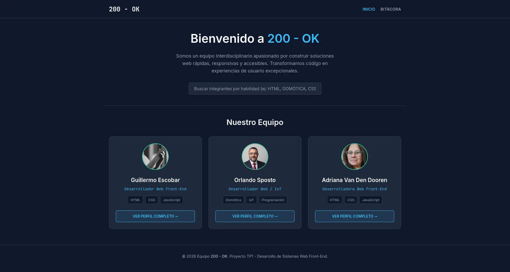
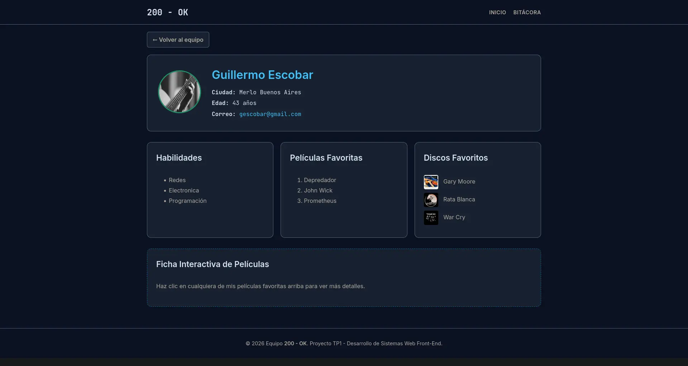
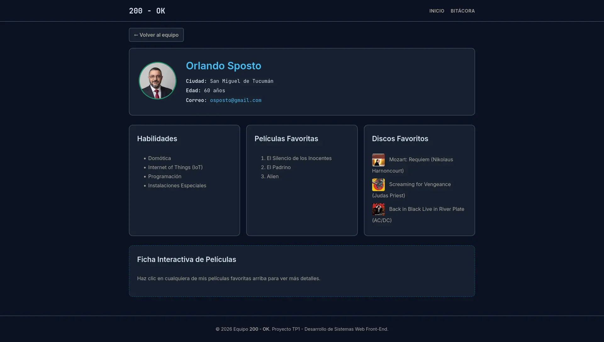
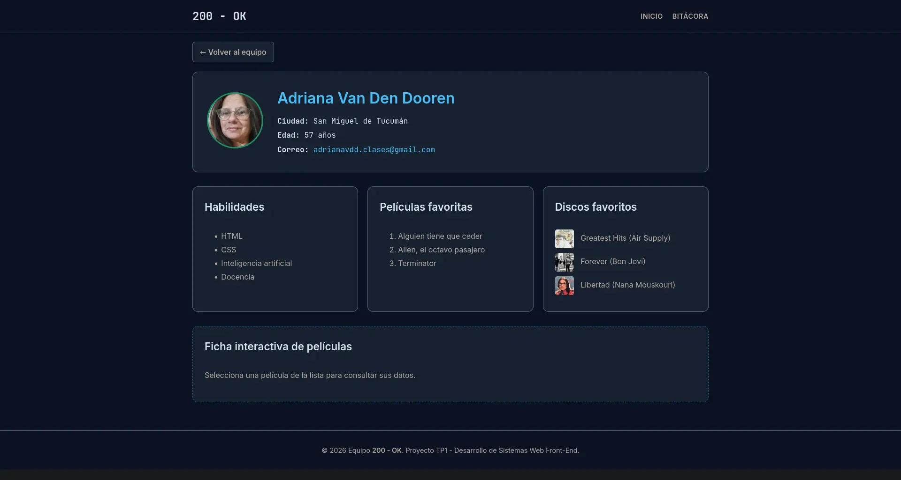

# 💻 Equipo 200 - OK | Trabajo Práctico Grupal 1 (TP1)

**Materia:** Desarrollo de Sistemas Web · Front-End (2026 · 2do Cuatrimestre)  
**Sitio publicado en Vercel:** [https://dsw-tp1.vercel.app/](https://dsw-tp1.vercel.app/)  
**Repositorio Oficial:** [https://github.com/osposto/dsw_tp1](https://github.com/osposto/dsw_tp1)

---

## 📌 1. Descripción del Proyecto

Este proyecto consiste en el diseño y desarrollo integral de un sitio web grupal construido con **HTML5 semántico, CSS3 adaptativo y JavaScript (ES6+)** sin dependencias ni frameworks externos. 

El sitio presenta la identidad del equipo **200 - OK** (inspirado en el código de estado HTTP que indica que una petición ha tenido éxito), e incluye:
- **Portada principal (`index.html`):** Presentación del propósito del equipo, buscador interactivo en tiempo real por nombre o habilidades, y tarjetas de los integrantes con acceso directo a sus perfiles.
- **Perfiles individuales (`perfil-1.html`, `perfil-2.html`, `perfil-3.html`):** Tarjetas extendidas con fotografía personal optimizada, ubicación, edad, correo de contacto, al menos cuatro habilidades técnicas/profesionales, tres películas favoritas, tres discos favoritos con portadas ilustradas y un componente interactivo propio en JavaScript.
- **Navegación interna completa:** Barra de navegación superior persistente y botones explícitos de retorno (`← Volver al equipo`) en todas las vistas, garantizando que el usuario pueda recorrer todo el sitio sin depender jamás del botón *"Atrás"* del navegador.
- **Bitácora de desarrollo (`bitacora.html`):** Registro cronológico de las decisiones arquitectónicas, los desafíos técnicos encontrados y las soluciones implementadas en equipo.

---

## 👥 2. Integrantes del Equipo

| Integrante | Rol / Especialidad | Perfil en el Sitio | Usuario de GitHub |
| :--- | :--- | :--- | :--- |
| **Guillermo Escobar** | Desarrollador Web Front-End · Redes y Electrónica | [`perfil-1.html`](./perfil-1.html) | [@elgylle](https://github.com/elgylle) |
| **Orlando Sposto** | Desarrollador Web / IoT · Domótica e Instalaciones | [`perfil-2.html`](./perfil-2.html) | [@osposto](https://github.com/osposto) |
| **Adriana Van Den Dooren** | Desarrolladora Web Front-End · IA y Docencia | [`perfil-3.html`](./perfil-3.html) | [@Adriana-vandendooren](https://github.com/Adriana-vandendooren) |

---

## 🛠️ 3. Tecnologías Utilizadas

- **HTML5:** Maquetación semántica (`<header>`, `<nav>`, `<main>`, `<section>`, `<article>`, `<footer>`, `<blockquote >`) y atributos de accesibilidad `ARIA` (`role="dialog"`, `aria-modal`, `aria-hidden`, `aria-labelledby`).
- **CSS3:** 
  - Variables globales (`Custom Properties` en `:root`) para consistencia temática.
  - Diseño **Mobile-First** utilizando **CSS Grid** y **Flexbox**.
  - Media Queries adaptadas a los breakpoints obligatorios de **`400px`**, **`900px`** y **`1200px`**.
  - Recorte inteligente de imágenes mediante `object-fit: cover`.
- **JavaScript (Vanilla ES6+):**
  - Manipulación del DOM y manejo de eventos (`input`, `click`, `keydown`).
  - Normalización Unicode (`String.prototype.normalize('NFD')`) para búsquedas insensibles a tildes y mayúsculas.
  - Animaciones nativas con la **Web Animations API** (`Element.animate` y curvas `cubic-bezier`).
  - Gestión de accesibilidad por teclado y control de foco activo.
- **Optimización Multimedia:** Compresión y conversión de imágenes al formato moderno **`.webp`** mediante *Squoosh* y *Birme*.
- **Control de Versiones y Despliegue:** Git, GitHub y despliegue continuo (CI/CD) en **Vercel**.

---

## 📂 4. Estructura de Archivos y Carpetas

El proyecto respeta estrictamente la organización solicitada en la consigna (archivos `.html` en la raíz y recursos separados por tipo):

```text
dsw_tp1/
├── index.html                  # Portada principal del equipo y buscador dinámico
├── perfil-1.html               # Página de perfil individual de Guillermo Escobar
├── perfil-2.html               # Página de perfil individual de Orlando Sposto
├── perfil-3.html               # Página de perfil individual de Adriana Van Den Dooren
├── bitacora.html               # Registro del proceso de desarrollo y decisiones del equipo
├── plantilla-perfil.html       # Plantilla base estandarizada para perfiles del equipo
├── README.md                   # Documentación técnica y guía del proyecto
├── MASTER_OUTLINE.md           # Hoja de ruta interna y control de requisitos de cátedra
├── css/
│   └── styles.css              # Hoja de estilos global, variables y Media Queries
├── js/
│   ├── main.js                 # Lógica de filtrado en tiempo real de la portada
│   ├── perfil-1.js             # Lógica del modal con rebote elástico (Guillermo)
│   ├── perfil-2.js             # Lógica del modal con fichas y citas célebres (Orlando)
│   └── perfil-3.js             # Lógica del modal accesible por teclado y ARIA (Adriana)
└── img/
    ├── capturas/               # Capturas de pantalla para la documentación del README
    ├── gescobar/               # Avatar, portadas de discos y pósters de Guillermo (.webp)
    │   ├── foto_perfil.webp
    │   ├── musica/
    │   └── pelis/
    ├── osposto/                # Avatar, portadas de discos y pósters de Orlando (.webp)
    │   ├── foto_perfil.webp
    │   ├── musica/
    │   └── pelis/
    └── avdd/                   # Avatar, portadas de discos y pósters de Adriana (.webp)
        ├── adri_foto.webp
        ├── musica/
        └── pelis/
```

---

## 🎨 5. Guía de Estilos y Diseño Adaptativo

### Paleta de Colores (Dark Theme)
Se definió una estética moderna inspirada en entornos de desarrollo profesional (tonos *Slate* combinados con acentos cian y verde esmeralda de alto contraste):

| Variable CSS | Código Hexadecimal | Rol Visual en el Sitio |
| :--- | :--- | :--- |
| `--bg-dark` | `#0f172a` | Fondo principal de la aplicación (Slate 900) |
| `--bg-card` | `#1e293b` | Fondo de tarjetas de equipo, perfiles y modales (Slate 800) |
| `--border-color` | `#334155` | Bordes contenedores y líneas divisoras sutiles (Slate 700) |
| `--text-main` | `#f8fafc` | Texto principal y encabezados de máxima legibilidad (Slate 50) |
| `--text-muted` | `#94a3b8` | Texto secundario, subtítulos y descripciones (Slate 400) |
| `--accent-primary` | `#38bdf8` | Acento primario: enlaces activos, títulos destacados y bordes interactivos (Sky Blue) |
| `--accent-hover` | `#0284c7` | Estado hover en botones e interacciones principales |
| `--accent-secondary` | `#34d399` | Acento secundario: anillos de avatares y citas destacadas (Emerald) |

### Tipografías (Google Fonts)
1. **`Inter` (Pesos 300, 400, 600):** Fuente *sans-serif* principal utilizada para títulos, párrafos de lectura y listas por su excelente legibilidad en pantallas móviles y de escritorio.
2. **`JetBrains Mono` (Pesos 400, 700):** Fuente monoespaciada de impronta técnica aplicada a la marca del equipo (`200 - OK`), roles, metadatos de los perfiles y fechas de la bitácora.

### Iconografía y Criterio Visual Multimedia
- **Simbología de interfaz:** Uso de entidades tipográficas limpias y universales (`&larr;` y `&rarr;` para indicadores de dirección en botones de navegación; `&times;` para cierre de ventanas modales) que no requieren carga adicional de librerías externas.
- **Proporciones normalizadas:**
  - *Avatares de integrantes:* Proporción `1:1` (recorte circular con `border-radius: 50%` y `object-fit: cover`).
  - *Portadas de discos:* Miniaturas cuadradas `1:1` (`40x40px`) integradas junto a cada álbum.
  - *Pósters de películas:* Proporción vertical de cine `2:3` (`140x200px` en vista modal).

### Comportamiento en Breakpoints Obligatorios
- **Base Móvil (`< 400px`):** Barra de navegación apilada verticalmente y grilla de 1 sola columna (`1fr`).
- **Breakpoint `400px` (`@media (min-width: 400px)`):** El encabezado pasa a disposición horizontal (`flex-direction: row; justify-content: space-between`).
- **Breakpoint `900px` (`@media (min-width: 900px)` y rango `900px–1199px`):** En perfiles individuales, las 3 secciones (Habilidades, Películas, Discos) se distribuyen en 3 columnas paralelas. En la portada para tablets, se muestran 2 tarjetas superiores y la tercera tarjeta centrada en la fila inferior (`grid-column: 1 / -1`).
- **Breakpoint `1200px` (`@media (min-width: 1200px)`):** Contenedor extendido a `1140px` y grilla principal de 3 columnas simétricas (`repeat(3, 1fr)`).

---

## ⚡ 6. Funciones Dinámicas con JavaScript

El proyecto incorpora interactividad real y libre de errores en consola tanto en la portada como en cada uno de los perfiles individuales, modularizada en archivos independientes:

### A. Portada Principal (`js/main.js`) — Buscador en Tiempo Real Insensible a Tildes
- **Explicación:** Captura el evento `input` sobre el cuadro de búsqueda (`#searchInput`). Aplica una función de normalización (`normalize('NFD').replace(/[\u0300-\u036f]/g, '')`) que elimina tildes y convierte a minúsculas tanto el término ingresado como el nombre del integrante y sus atributos `data-skills`. Evalúa coincidencias en tiempo real mostrando (`display: flex`) u ocultando (`display: none`) las tarjetas correspondientes sin recargar la página.
- **Captura de pantalla:**
  

---

### B. Perfil 1: Guillermo Escobar (`js/perfil-1.js`) — Modal con Animación Elástica (Web Animations API)
- **Explicación:** Al hacer clic en cualquiera de sus películas favoritas (*Depredador*, *John Wick*, *Prometheus*), el script inyecta dinámicamente el póster, director, sinopsis y frase icónica en la ventana modal y ejecuta una animación física de rebote de entrada (*Bounce In*) utilizando la **Web Animations API** nativa (`modalContent.animate()` con curva `cubic-bezier(0.175, 0.885, 0.32, 1.275)`). Al cerrar (con el botón `×`, clic en el fondo oscuro o tecla `Escape`), reproduce una animación inversa de contracción (*Bounce Out*) antes de ocultar el contenedor en el evento `onfinish`.
- **Captura de pantalla:**
  

---

### C. Perfil 2: Orlando Sposto (`js/perfil-2.js`) — Ficha Técnica y Citas Célebres
- **Explicación:** Escucha los eventos de clic sobre la lista de películas favoritas (*El Silencio de los Inocentes*, *El Padrino*, *Alien*) identificadas mediante el atributo `data-movie`. Consulta un diccionario estructurado (`movieData`) e inyecta en el DOM el título, director, sinopsis, cita célebre destacada (`<blockquote>`) y la ruta de la imagen `.webp` del póster, alternando las clases CSS `.modal-hidden` y `.modal-active` y permitiendo el cierre tanto desde el botón de control como haciendo clic fuera de la tarjeta.
- **Captura de pantalla:**
  

---

### D. Perfil 3: Adriana Van Den Dooren (`js/perfil-3.js`) — Modal Accesible por Teclado y ARIA (a11y)
- **Explicación:** Despliega la ficha detallada (incluyendo año de estreno, dirección, sinopsis y póster) de sus películas (*Alguien tiene que ceder*, *Alien, el octavo pasajero*, *Terminator*) con un enfoque centrado en la **accesibilidad web**. El script asigna dinámicamente `tabIndex = 0`, `role="button"` y `aria-haspopup="dialog"` a cada ítem para que puedan enfocarse con la tecla `Tab` y activarse presionando `Enter` o `Espacio`. Al abrirse el modal, actualiza `aria-hidden="false"`, traslada el foco al botón de cierre (`closeBtn.focus()`) y, al cerrarse (vía clic o tecla `Escape`), restablece el foco exactamente en el elemento de la lista que lo originó (`lastMovieItem?.focus()`).
- **Captura de pantalla:**
  

---

## 🤖 7. Uso de Inteligencia Artificial y Autoría (Requisito Transversal)

En cumplimiento con el apartado **05. Uso de IA y autoría** de la consigna, documentamos de forma transparente cómo se integraron herramientas de IA generativa durante el desarrollo del proyecto:

### 1. Aplicaciones, Modelos y Modalidad de Uso
- **Herramientas utilizadas:** Asistente de codificación integrado en Visual Studio Code (**Google Antigravity** operando con los modelos **Gemini 3.1 Pro** y **Gemini Flash**) y consultas puntuales en **ChatGPT**.
- **Tipo de plan:** Uso combinado de cuentas educativas/gratuitas y suscripción de asistente integrado en el editor.
- **Experiencia previa del equipo:** Los integrantes contaban con experiencia previa diversa en programación, lógica de sistemas, redes, electrónica, IoT/domótica y docencia universitaria/terciaria, lo que permitió dirigir a la IA con instrucciones técnicas precisas y evaluar críticamente cada bloque de código sugerido.

### 2. Áreas de Asistencia (Código, Diseño y Debugging)
- **Estructuración y CSS Adaptativo:** Asistencia en la definición de la paleta de colores en variables `:root` y en la resolución del comportamiento en cascada de CSS Grid cuando el equipo pasó de 4 a 3 integrantes, implementando un rango de Media Query (`@media (min-width: 900px) and (max-width: 1199px)`) para evitar sobreescrituras innecesarias en escritorio.
- **Debugging y Resolución de Errores:**
  - Diagnóstico de un *bucle infinito de carga* en el navegador producido por un atributo `onerror` en etiquetas `` cuando aún no existían las imágenes locales.
  - Reparación de un error crítico de repositorio (`fatal: .git/index: index file smaller than expected`) reconstruyendo el índice de Git sin pérdida de código.
  - Corrección en la secuencia de eventos de cierre en `js/perfil-1.js` para permitir que la animación `bounceOut` se reprodujera completamente antes de aplicar `display: none`.
- **Refinamiento de JavaScript:** Sugerencia del método `.normalize('NFD')` en `js/main.js` para ignorar tildes en el buscador, e implementación de buenas prácticas de manejo de foco y atributos `ARIA` en `js/perfil-3.js`.

### 3. Criterio de Privacidad, Imágenes y Recursos Multimedia
- **Fotografías y recursos gráficos:** El equipo decidió utilizar **fotografías reales propias** para los avatares y portadas/pósters oficiales de sus obras favoritas (no se generaron rostros ni avatares finales mediante IA generativa de imágenes). 
- Durante la etapa temprana de maquetación (antes de contar con las fotografías definitivas), se empleó el servicio de marcador de posición `ui-avatars.com` para generar avatares tipográficos con las iniciales de cada miembro.
- Todas las imágenes definitivas fueron recortadas y comprimidas manualmente por el equipo utilizando **Squoosh** y **Birme** al formato `.webp`, respetando relaciones de aspecto `1:1` (avatares y álbumes) y `2:3` (pósters).

### 4. Revisión, Adaptación y Autoría del Equipo
La autoría y las decisiones técnicas estuvieron siempre bajo el control del equipo:
- **Modularización de scripts:** Inicialmente la IA había propuesto un único archivo `js/perfiles.js` compartido. Con criterio propio, decidimos refactorizar la arquitectura hacia archivos individuales (`perfil-1.js`, `perfil-2.js`, `perfil-3.js`), lo que evitó conflictos de fusión (*merge conflicts*) cuando los tres integrantes trabajamos en simultáneo sobre el repositorio.
- **Personalización funcional:** Cada integrante diseñó, probó y adaptó los datos reales de su perfil, eligiendo qué enfoque darle a su interacción en JavaScript (animaciones físicas, citas literarias o accesibilidad por teclado).
- **Verificación manual:** Cada cambio propuesto fue inspeccionado línea por línea, probado localmente en distintos anchos de pantalla (`400px`, `900px`, `1200px` y `1900px`) y validado antes de realizar los commits al repositorio.

---

## 🚀 8. Sección de Evolución (Próximos Trabajos)

Como proyección para las siguientes instancias de la materia, el sitio fue diseñado con una base escalable que permitirá incorporar:
1. **Migración a Arquitectura Basada en Componentes:** Transformar las tarjetas de integrantes, el buscador y los modales en componentes reutilizables mediante un framework moderno (como *React*).
2. **Consumo de APIs Externas:** Conectar las secciones de Películas y Discos a APIs públicas (por ejemplo, *TMDB API* o *Spotify / Last.fm API*) para obtener metadatos, tráilers o previsualizaciones de audio en tiempo real.
3. **Selector de Tema (Claro / Oscuro) Persistente:** Aprovechar las variables CSS ya definidas en `:root` para sumar un interruptor de tema claro/oscuro que guarde la preferencia del usuario en `localStorage`.
4. **Formulario de Contacto Interactivo:** Reemplazar el enlace `mailto:` por un formulario de contacto con validación dinámica en JavaScript y envío asíncrono.

---

© 2026 Equipo **200 - OK** · Desarrollo de Sistemas Web (Front-End)
